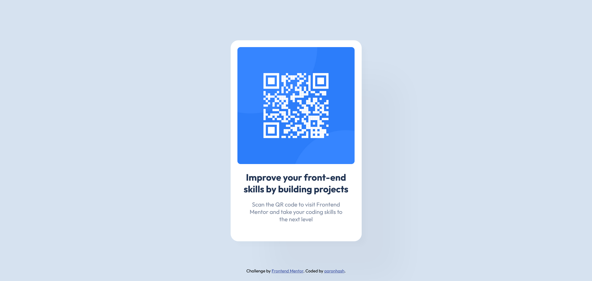

# Frontend Mentor - QR code component solution

This is a solution to the [QR code component challenge on Frontend Mentor](https://www.frontendmentor.io/challenges/qr-code-component-iux_sIO_H). Frontend Mentor challenges help you improve your coding skills by building realistic projects. 

## Table of contents

- [Overview](#overview)
  - [Screenshot](#screenshot)
  - [Links](#links)
- [Notes](#acknowledgments)

## Overview

### Screenshot

### Links
- Live Site URL: [https://aaronhash.github.io/aaronhash-FMQRCode/](https://aaronhash.github.io/aaronhash-FMQRCode/)

## Notes

While cleaning up my bookmarks, I saw a Practice collection where FrontEnd Mentor is added, so why not try these projects during spare time. 😁
